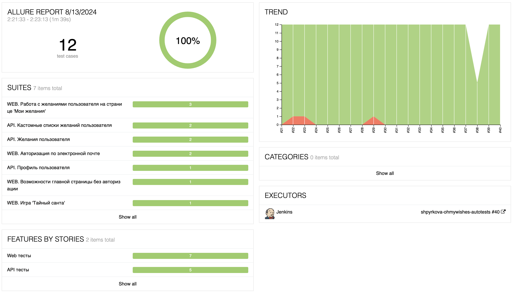

<h1>Проект автоматизации тестирования приложения <a target="_blank" href="https://ohmywishes.ru/"> Ohmywishes </a> </h1>

<p align="center">

</p>

## Содержание
+ [Описание](#Описание)
+ [Технологии и инструменты](#Технологии-и-инструменты)
+ [Реализованные проверки](#Реализованные-проверки)
+ [Запуск тестов](#Запуск-тестов)
  + [Допустимые комбинации](#Допустимые-комбинации)
  + [Запуск тестов на Jenkins](#Запуск-тестов-на-Jenkins)
  + [Локальный запуск тестов](#Локальный-запуск-тестов)
+ [Пример выполнения WEB теста в Selenoid](#Пример-выполнения-WEB-теста-в-Selenoid)
+ [Интеграция с Allure Report](#Интеграция-с-Allure-report)
+ [Интеграция с Allure TestOps](#Интеграция-с-Allure-TestOps)
+ [Интеграция с Jira](#Интеграция-с-Jira)
+ [Уведомления в Telegram с использованием бота](#Уведомления-в-Telegram-с-использованием-бота)


## Описание
Ohmywishes — сервис для создания вишлистов. Можно создавать собственные вишлисты и следить за тем, о чём мечтают ваши друзья.
Проект автоматизации состоит из трех частей:
- UI-тесты на WEB-приложение
- Тесты на API WEB-приложения 
- Мобильные тесты на Android <br/>


**Особенности проекта**:
- `Page Object` для описания страниц WEB приложения
- Использование `Owner` для придания тестам легкости конфигурации
- Возможность запуска тестов: локально, удалённо, по тегам
- Использование `Faker` для генерации данных
- Использование `Lombok` для моделей данных
- Для ускорения тестов предусловия в WEB и API тестах создаются через API
- Возможность запуска тестов напрямую из Allure TestOps
- Интеграция с Jira
- Уведомление о результатах прохождения в Telegram
- По результатам прохождения автотестов генерируется Allure отчет. Содержание отчета:
    - Шаги теста
    - Скриншот страницы (экрана) на последнем шаге
    - Логи консоли браузера
    - Видео выполнения автотеста

## Технологии и инструменты

<div align="center">
<a href="https://www.jetbrains.com/idea/"></a>
<a href="https://github.com/"></a>  
<a href="https://www.java.com/"></a>
<a href="https://gradle.org/"></a>  
<a href="https://junit.org/junit5/"></a>
<a href="https://selenide.org/"></a>
<a href="https://aerokube.com/selenoid/"></a>
<a href="https://rest-assured.io/"></a>
<a href="https://appium.io/"></a>
<a href="https://developer.android.com/studio"></a>
<a href="https://www.jenkins.io/"></a>
<a href="https://github.com/allure-framework/"></a>
<a href="https://qameta.io/"></a>
<a href="https://www.atlassian.com/software/jira"></a>  
<a href="https://telegram.org/"></a>
</div>

## Реализованные проверки
### WEB
- [x] Успешная авторизация по email и паролю
- [x] Попытка авторизации с невалидным паролем
- [x] Главная страница: Для неавторизованного пользователя по переходу на 'Мои желания' открывается страница авторизации
- [x] Создание нового желания с заполнением всех полей
- [x] Отметка желания как подаренного
- [x] Добавление желания в созданный пользователем список
- [x] Создание игры Тайный санта с заполнением всех полей

### API
- [x] Получение данных о пользователе (о себе)
- [x] Получение данных о желании неавторизованным пользователем
- [x] Удаление желания
- [x] Создание списка желаний
- [x] При удалении кастомного списка желаний желания из этого списка не удаляются из системы

### Mobile
- [x] Авторизация по электронной почте
- [x] Запрос на сброс пароля

## Запуск тестов
Тесты могут запускаться с разными конфигурациями (локально, удаленно, на разных браузерах, мобильные - на разных устройствах) <br>
Конфигурационные файлы `.properties` лежат в папке `resources`. <br/>
При необходимости в этих файлах можно менять параметры окружения (браузеры, устройства и их версии).

### Допустимые комбинации


### Запуск тестов на Jenkins
Так как тесты на Android запускаются только локально на эмуляторе или реальном устройстве, для Jenkins выделена отдельная задача for_jenkins, запускающая все WEB и API тесты. <br>
Для запуска на jenkins необходимо также указывать параметр удаленного запуска -Denv=remote. 
```
gradle clean for_jenkins -Denv=remote
```
#### Параметры, которыми можно управлять (указывать их необязательно):
```
-DbrowserName - наименование браузера (по умолчанию - chrome).
-DbrowserVersion - номер версии браузера (по умолчанию - 122).
-DbrowserSize - размер окна браузера (по умолчанию - 1980x1080).
```
### Локальный запуск тестов
Тесты могут быть запущены как командами через терминал, так и по кнопке в IntelliJ IDEA. 
#### WEB
Команда без параметров по умолчанию запускает все тесты локально: 

```
gradle clean web
```
Локально WEB тесты по умолчанию запускаются в браузере chrome, версия latest, размер браузера 1920x1080. <br>

Для запуска на удаленном Selenoid нужно указать параметр env:
```
gradle clean web -Denv=remote
```

#### API
Команда запускает все API тесты: 
```
gradle clean api 
```

#### MOBILE

Для запуска мобильных тестов нужно: 
1. Запустить Appium Server и устройство, на котором будут выполняться тесты.
2. Обновить параметры устройства в файлах resources/mobile/real.properties или resources/mobile/emulation.properties.
3. Определить значение Ddevice:
- <code>-Ddevice=emulator</code> : тесты будут запущены в эмуляторе. 
- <code>-Ddevice=real</code> : тесты будут запущены на реальном подключенном устройстве. 
4. Запустить следующую команду с указанием device:
```
gradle clean android -Ddevice=emulation
```

#### Построение Allure отчета после локального запуска

Команда для открытия отчета в браузере:
```
gradle allureServe
```

## Пример выполнения WEB теста в Selenoid

> К результатам прогонов web-тестов, запущенных на Selenoid, прикладывается видео выполнения теста.
<p align="center">
  
</p>


# Интеграция с Allure report
Ссылка доступна только с авторизацией: <b><a target="_blank" href="https://jenkins.autotests.cloud/job/shpyrkova-ohmywishes-autotests/40/allure/">Allure report</a></b>



#### Развернутый результат прохождения теста:


## Интеграция с Allure TestOps
Ссылка доступна только с авторизацией: <b><a target="_blank" href="https://allure.autotests.cloud/project/4364/dashboards">Allure TestOps</a></b>

>Диаграммы прохождения тестов
>


## Интеграция с Jira
Ссылка доступна только с авторизацией: <b><a target="_blank" href="https://jira.autotests.cloud/browse/HOMEWORK-1317">Jira</a></b>

>В Jira создана задача на автоматизацию тестов
>


>В разделе `Allure:Test Cases` отображаются автоматизированные тесты из Allure TestOps
> 


>В разделе `Allure:Launches` отображается история запусков тестов из Allure TestOps, к которым прилинкована данная задача
> 


## Уведомления в Telegram с использованием бота

> В Telegram создан канал, куда отправляются результаты прогона тестов в Jenkins. Бот после завершения прогона отправляет сообщение с отчетом о статусе прогона.<br>
> Для уведомлений в Telegram используется библиотека <b><a target="_blank" href="https://github.com/qa-guru/allure-notifications">allure-notifications</a></b>. JAR библиотеки лежит в Jenkins.
>

